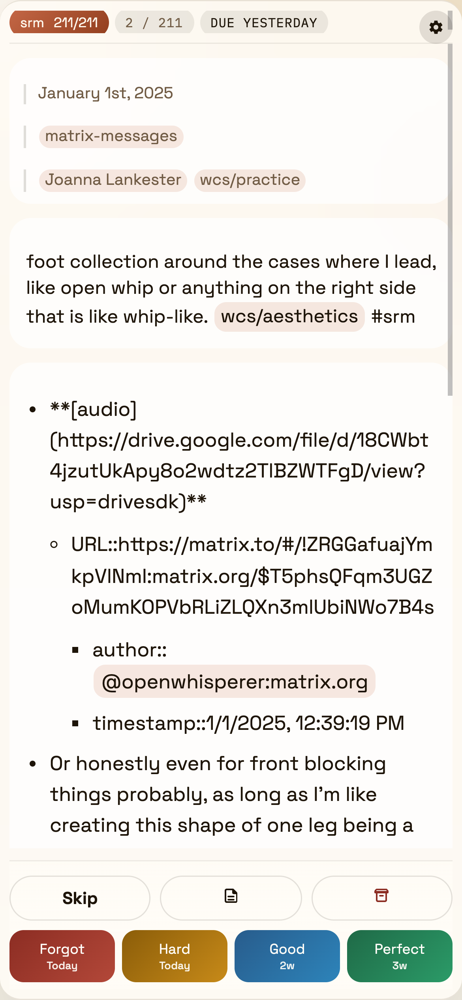
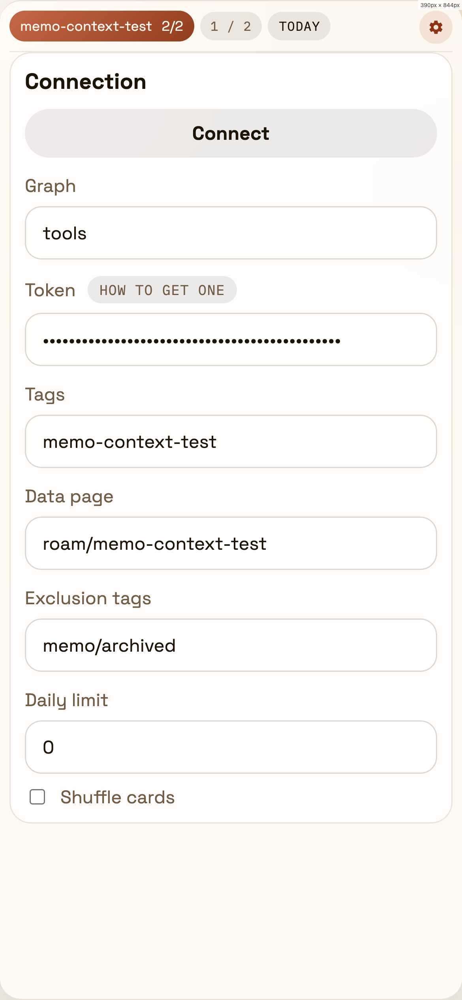

# Roam Memo Standalone

Mobile-first spaced repetition for Roam Research, built as a standalone React + TypeScript web app. It talks directly to the Roam backend API, reuses Memo's scheduling/data model, and lets you review cards without opening the full Roam UI.

| Review | Setup |
| --- | --- |
|  |  |

## What It Does

- Loads Memo cards directly from your Roam graph via backend API token
- Uses the same `roam/memo > data` structure as Memo
- Writes review results back to Roam with optimistic UI updates
- Supports due/new cards, full nested child answers, and parent/page context
- Lets you archive cards or flag them for later follow-up in Roam with `[[memo/to-review]]`
- Works well on mobile with compact controls and touch gestures

## Review UX

- Full-screen review mode after connect
- Compact mobile layout with sticky review controls
- Swipe right on card content to reveal the answer
- Swipe left on card content to mark the card `[[memo/to-review]]`
- Keyboard shortcuts still work on desktop:

| Action | Shortcut |
| --- | --- |
| Reveal answer | `space` |
| Grade: forgot | `f` |
| Grade: hard | `h` |
| Grade: good | `g` |
| Grade: perfect | `space` |
| Skip | `→` |

## Roam Data Model

The standalone app reads and writes the same Memo metadata pages as the original project:

- review data page: `roam/memo`
- archived cards: `[[memo/archived]]`
- send back to Roam for follow-up: `[[memo/to-review]]`

That means you can review from the standalone app and still keep Roam as the source of truth.

## Getting Started

1. Create cards in Roam by tagging blocks with your Memo tag, for example `#memo` or `#srm`.
2. In Roam, open graph settings and create a backend API token.
3. Open the standalone app.
4. Enter:
   - graph name
   - backend API token
   - tags to review
   - Memo data page, usually `roam/memo`
5. Connect and start reviewing.

## Local Development

```bash
npm install
npm run web:dev
```

Useful scripts:

- `npm run web:dev` starts the standalone app with Vite
- `npm run web:build` creates the production build in `standalone-dist`
- `npm run web:typecheck` type-checks the standalone app
- `npm test` runs the project test suite
- `npm run lint` runs ESLint

## Deployment

GitHub Pages is configured to publish the standalone app from the site root. The deploy workflow:

1. installs dependencies
2. runs tests
3. builds the legacy extension
4. type-checks and builds the standalone app
5. publishes `standalone-dist` as the Pages artifact root

## Support

If Rememo is useful to you, you can support it here:

- Buy Me a Coffee: [buymeacoffee.com/vlad.sitalo](https://buymeacoffee.com/vlad.sitalo)
- GitHub Sponsors: [github.com/sponsors/Stvad](https://github.com/sponsors/Stvad)
- Patreon: [patreon.com/stvad](https://www.patreon.com/stvad)

## Project Notes

This repository still contains the original Memo extension source and shared scheduling logic. The current hosted product and README are centered on the standalone reviewer.
